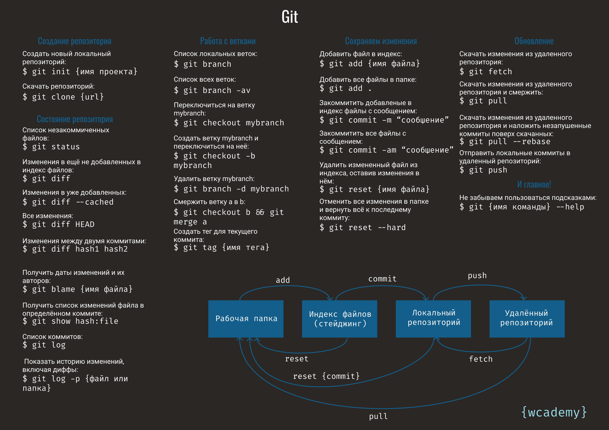

# Git - шпаргалка

[Подключение SSH к GitHub](main.txt)<br>
[Документация по GitHub](https://docs.github.com/ru)<br>
[Документация по Git](https://git-scm.com/doc)<br>

Git — это распределенная система управления версиями, используемая для отслеживания изменений в исходном коде и координации работы между разработчиками. Она была создана Линусом Торвальдсом в 2005 году для управления разработкой ядра Linux и с тех пор стала одной из самых популярных систем управления версиями в мире.

### Основные особенности Git:

1. **Распределенность:**
   - Каждый разработчик имеет полную копию всего репозитория, включая всю его историю. Это позволяет работать автономно и обеспечивает безопасность данных.

2. **Эффективное ветвление и слияние:**
   - Git позволяет легко создавать и управлять ветками, что упрощает работу над новыми функциями и исправлениями. Слияние веток также осуществляется быстро и эффективно.

3. **Высокая производительность:**
   - Git оптимизирован для быстрого выполнения операций, таких как коммит, создание веток, слияние и переключение между ветками.

4. **Защита данных:**
   - Git использует SHA-1 хеши для идентификации каждого коммита и объектов в репозитории, что обеспечивает защиту данных и целостность истории изменений.

### Основные команды Git:

- **`git init`** - Инициализация нового репозитория.
- **`git clone`** - Клонирование существующего репозитория.
- **`git add`** - Добавление изменений в индекс (стейджинг).
- **`git commit`** - Фиксация изменений с описанием.
- **`git status`** - Отображение состояния рабочего каталога и индекса.
- **`git log`** - Просмотр истории коммитов.
- **`git branch`** - Управление ветками.
- **`git checkout`** - Переключение между ветками или возврат к предыдущему состоянию.
- **`git merge`** - Слияние веток.
- **`git pull`** - Извлечение и интеграция изменений из удаленного репозитория.
- **`git push`** - Отправка изменений в удаленный репозиторий.

### Почему использовать Git:

- **Совместная работа:** Git упрощает работу в команде, позволяя легко объединять изменения от разных разработчиков.
- **История изменений:** Полная история изменений позволяет отслеживать, кто, когда и почему внес изменения в код.
- **Ветвление и слияние:** Простота управления ветками позволяет работать над несколькими функциями одновременно и безопасно интегрировать их.
- **Резервное копирование:** Поскольку каждый разработчик имеет полную копию репозитория, данные надежно защищены от потерь.

Git является мощным инструментом для управления исходным кодом и широко используется в разработке программного обеспечения.


### Создание репозитория

1. **Создать новый локальный репозиторий:**

   ```bash
   git init my_project
   ```

   Это создаст новый каталог `.git` в вашем проекте с именем `my_project`, который будет содержать все необходимые файлы репозитория. Пример использования:

   ```bash
   mkdir my_project
   cd my_project
   git init
   ```

   Вывод:

   ```plaintext
   Initialized empty Git repository in /path/to/my_project/.git/
   ```

2. **Скачать репозиторий:**

   ```bash
   git clone https://github.com/user/repo.git
   ```

   Это склонирует удаленный репозиторий на ваш локальный компьютер. Примеры использования:

   ```bash
   git clone https://github.com/torvalds/linux.git
   ```

   Вывод:

   ```plaintext
   Cloning into 'linux'...
   remote: Enumerating objects: 100, done.
   remote: Counting objects: 100% (100/100), done.
   remote: Compressing objects: 100% (85/85), done.
   remote: Total 100 objects (delta 12), reused 55 (delta 7), pack-reused 0
   Receiving objects: 100% (100/100), 60.50 KiB | 1.20 MiB/s, done.
   Resolving deltas: 100% (12/12), done.
   ```

### Состояние репозитория

1. **Список незакоммиченных файлов:**

   ```bash
   git status
   ```

   Пример использования:

   ```plaintext
   On branch master
   Changes not staged for commit:
     (use "git add <file>..." to update what will be committed)
     (use "git restore <file>..." to discard changes in working directory)
       modified:   file1.txt
       modified:   file2.txt
   ```

2. **Изменения в еще не добавленных в индекс файлов:**

   ```bash
   git diff
   ```

   Пример использования:

   ```plaintext
   diff --git a/file1.txt b/file1.txt
   index 83db48f..b2e54c7 100644
   --- a/file1.txt
   +++ b/file1.txt
   @@ -1 +1 @@
   -Hello World
   +Hello Git
   ```

3. **Изменения в уже добавленных:**

   ```bash
   git diff --cached
   ```

   Пример использования:

   ```plaintext
   diff --git a/file2.txt b/file2.txt
   index 83db48f..b2e54c7 100644
   --- a/file2.txt
   +++ b/file2.txt
   @@ -1 +1 @@
   -Hello
   +Hello Git
   ```

4. **Все изменения:**

   ```bash
   git diff HEAD
   ```

   Пример использования:

   ```plaintext
   diff --git a/file1.txt b/file1.txt
   index 83db48f..b2e54c7 100644
   --- a/file1.txt
   +++ b/file1.txt
   @@ -1 +1 @@
   -Hello World
   +Hello Git
   ```

5. **Изменения между двумя коммитами:**

   ```bash
   git diff hash1 hash2
   ```

   Пример использования:

   ```bash
   git diff abc123 def456
   ```

   Пример вывода:

   ```plaintext
   diff --git a/file1.txt b/file1.txt
   index 83db48f..b2e54c7 100644
   --- a/file1.txt
   +++ b/file1.txt
   @@ -1 +1 @@
   -Hello World
   +Hello Git
   ```

6. **Получить даты изменений и их авторов:**

   ```bash
   git blame filename
   ```

   Пример использования:

   ```bash
   git blame file1.txt
   ```

   Пример вывода:

   ```plaintext
   abc123 (Alice 2021-01-01 12:00:00 +0100 1) Hello World
   ```

7. **Получить список изменений файла в определенном коммите:**

   ```bash
   git show hash:file
   ```

   Пример использования:

   ```bash
   git show abc123:file1.txt
   ```

   Пример вывода:

   ```plaintext
   diff --git a/file1.txt b/file1.txt
   index 83db48f..b2e54c7 100644
   --- a/file1.txt
   +++ b/file1.txt
   @@ -1 +1 @@
   -Hello World
   +Hello Git
   ```

8. **Список коммитов:**

   ```bash
   git log
   ```

   Пример использования:

   ```plaintext
   commit abc123 (HEAD -> master)
   Author: Alice <alice@example.com>
   Date:   Mon Jul 14 12:00:00 2023 +0100

       Initial commit
   ```

9. **Показать историю изменений, включая диффы:**

   ```bash
   git log -p filename
   ```

   Пример использования:

   ```bash
   git log -p file1.txt
   ```

   Пример вывода:

   ```plaintext
   commit abc123 (HEAD -> master)
   Author: Alice <alice@example.com>
   Date:   Mon Jul 14 12:00:00 2023 +0100

       Initial commit

   diff --git a/file1.txt b/file1.txt
   index 83db48f..b2e54c7 100644
   --- a/file1.txt
   +++ b/file1.txt
   @@ -1 +1 @@
   -Hello World
   +Hello Git
   ```

### Работа с ветками

1. **Список локальных веток:**

   ```bash
   git branch
   ```

   Пример использования:

   ```plaintext
   * master
     feature-branch
   ```

2. **Список всех веток:**

   ```bash
   git branch -av
   ```

   Пример использования:

   ```plaintext
   * master
     remotes/origin/HEAD -> origin/master
     remotes/origin/feature-branch
   ```

3. **Переключиться на ветку:**

   ```bash
   git checkout mybranch
   ```

   Пример использования:

   ```plaintext
   Switched to branch 'mybranch'
   ```

4. **Создать ветку и переключиться на неё:**

   ```bash
   git checkout -b mybranch
   ```

   Пример использования:

   ```plaintext
   Switched to a new branch 'mybranch'
   ```

5. **Удалить ветку:**

   ```bash
   git branch -d mybranch
   ```

   Пример использования:

   ```plaintext
   Deleted branch mybranch (was abc123).
   ```

6. **Смержить ветку:**

   ```bash
   git checkout b
   git merge a
   ```

   Пример использования:

   ```plaintext
   Switched to branch 'b'
   Updating abc123..def456
   Fast-forward
    file1.txt | 1 +
    1 file changed, 1 insertion(+)
   ```

7. **Создать тег для текущего коммита:**

   ```bash
   git tag tagname
   ```

   Пример использования:

   ```bash
   git tag v1.0
   ```

   Тег `v1.0` теперь присвоен текущему коммиту.

### Сохранение изменений

1. **Добавить файл в индекс:**

   ```bash
   git add filename
   ```

   Пример использования:

   ```bash
   git add file1.txt
   ```

   Файл `file1.txt` добавлен в индекс.

2. **Добавить все файлы в папке:**

   ```bash
   git add .
   ```

   Пример использования:

   ```bash
   git add .
   ```

   Все файлы в текущем каталоге и его подкаталогах добавлены в индекс.

3. **Закоммитить добавленные в индекс файлы с сообщением:**

   ```bash
   git commit -m "сообщение"
   ```

   Пример использования:

   ```bash
   git commit -m "Initial commit"
   ```

   Пример вывода:

   ```plaintext
   [master (root-commit) abc1234] Initial commit
   1 file changed, 1 insertion(+)
   create mode 100644 file1.txt
   ```

4. **Закоммитить все файлы с сообщением:**

   ```bash
   git commit -am "сообщение"
   ```

   Пример использования:

   ```bash
   git commit -am "Updated file1 and file2"
   ```

   Пример вывода:

   ```plaintext
   [master abc1234] Updated file1 and file2
   2 files changed, 2 insertions(+), 2 deletions(-)
   ```

5. **Удалить измененный файл из индекса

, оставив изменения в нём:**

   ```bash
   git reset filename
   ```

   Пример использования:

   ```bash
   git reset file1.txt
   ```

   Файл `file1.txt` удален из индекса, но изменения сохранены.

6. **Отменить все изменения в папке и вернуть всё к последнему коммиту:**

   ```bash
   git reset --hard
   ```

   Пример использования:

   ```bash
   git reset --hard
   ```

   Пример вывода:

   ```plaintext
   HEAD is now at abc123 Initial commit
   ```

### Обновление

1. **Скачать изменения из удаленного репозитория:**

   ```bash
   git fetch
   ```

   Пример использования:

   ```plaintext
   remote: Enumerating objects: 5, done.
   remote: Counting objects: 100% (5/5), done.
   remote: Compressing objects: 100% (3/3), done.
   remote: Total 3 (delta 1), reused 0 (delta 0)
   Unpacking objects: 100% (3/3), done.
   From https://github.com/user/repo
    * [new branch]      feature-branch -> origin/feature-branch
   ```

2. **Скачать изменения из удаленного репозитория и смержить:**

   ```bash
   git pull
   ```

   Пример использования:

   ```plaintext
   remote: Enumerating objects: 5, done.
   remote: Counting objects: 100% (5/5), done.
   remote: Compressing objects: 100% (3/3), done.
   remote: Total 3 (delta 1), reused 0 (delta 0)
   Unpacking objects: 100% (3/3), done.
   From https://github.com/user/repo
      abc123..def456  master     -> origin/master
   Updating abc123..def456
   Fast-forward
    file1.txt | 1 +
    1 file changed, 1 insertion(+)
   ```

3. **Скачать изменения из удаленного репозитория и наложить незапушенные коммиты поверх скачанных:**

   ```bash
   git pull --rebase
   ```

   Пример использования:

   ```plaintext
   remote: Enumerating objects: 5, done.
   remote: Counting objects: 100% (5/5), done.
   remote: Compressing objects: 100% (3/3), done.
   remote: Total 3 (delta 1), reused 0 (delta 0)
   Unpacking objects: 100% (3/3), done.
   From https://github.com/user/repo
      abc123..def456  master     -> origin/master
   First, rewinding head to replay your work on top of it...
   Applying: Updated file1 and file2
   ```

4. **Отправить локальные коммиты в удаленный репозиторий:**

   ```bash
   git push
   ```

   Пример использования:

   ```plaintext
   Enumerating objects: 5, done.
   Counting objects: 100% (5/5), done.
   Delta compression using up to 8 threads
   Compressing objects: 100% (3/3), done.
   Writing objects: 100% (3/3), 370 bytes | 370.00 KiB/s, done.
   Total 3 (delta 1), reused 0 (delta 0)
   To https://github.com/user/repo
      abc123..def456  master -> master
   ```

### Подсказки

1. **Использование подсказок:**

   ```bash
   git command --help
   ```

   Пример использования:

   ```bash
   git commit --help
   ```

   Откроет справочную информацию о команде `git commit`.

